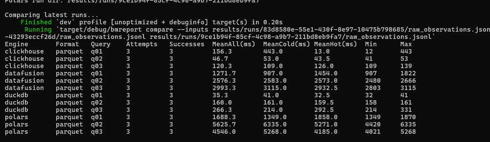

# rs-bench

`rs-bench` is a Rust-first benchmark harness for comparing analytics/query engines across multiple dataset formats and workload shapes.

### Sample: Clickhouse vs. Datafusion vs. Duckdb vs. Polars (10 000 000 rows)

<p align="center">
  
</p>

The project is inspired by:
- **ClickBench** for benchmark philosophy, reproducibility, and comparable reporting
- the **DataFusion benchmark shape inside ClickBench** for keeping the execution model small, explicit, and inspectable
- a **thin adapter architecture** so engines can be swapped in and out behind a common contract

Useful docs:

- [docs/live_stream_testing.md](docs/live_stream_testing.md) for the live producer + live processor workflow

The current implementation is intentionally MVP-sized:
- explicit dataset generation
- explicit benchmark execution
- raw result persistence
- separate reporting/comparison
- thin engine adapters
- local-first workflow

The design goal is to benchmark engines as **black boxes** while keeping:
- benchmark inputs reproducible
- workload definitions inspectable on disk
- raw observations persisted first
- reporting separate from execution

---

## Current project status

The project currently supports:

### Dataset generation
- synthetic **clickstream** dataset family
- deterministic generation from config + seed
- shared logical dataset metadata
- multiple physical materializations

### Dataset formats
- CSV
- JSONL
- Parquet

### Engines
- Mock adapter
- DataFusion
- DuckDB
- ClickHouse
- `stream_local` reference streaming adapter
- `mini_flink` MVP continuous streaming engine

### Workload coverage
Current smoke workload for clickstream includes:
- `q01` scan/filter
- `q02` group by
- `q03` aggregation

### Reporting
- single-run summarization
- multi-run comparison
- hot vs cold split
- comparison across engines and formats
- streaming summarization and comparison for local stream runs

---

## Core design principles

### 1. Engines are swappable black boxes
Each engine is integrated behind a shared lifecycle contract.

The runner does not need to know internal engine details beyond what is exposed by the adapter.

### 2. Logical dataset != physical format
A dataset is defined once logically, then materialized into multiple physical formats.

This allows benchmark comparisons such as:
- same engine on CSV vs Parquet
- same query on different file formats
- different engines on the same logical data

### 3. Raw results first
The benchmark runner persists raw per-query-per-repetition observations.

Summaries and comparisons are derived later by the reporting layer.

### 4. Small explicit benchmark convention
The project intentionally avoids building a giant benchmark platform.

Instead it follows a simple flow:
1. generate data
2. run benchmarks
3. persist raw observations
4. summarize / compare separately

---

## Repository structure

```text
rs-bench/
├── apps/
│   ├── bmgen/         # dataset generator CLI
│   ├── bmproduce/     # live event producer CLI
│   ├── bmrun/         # benchmark runner CLI
│   └── bmreport/      # reporting / comparison CLI
│
├── crates/
│   ├── bm-core/       # shared utilities / config helpers
│   ├── bm-schema/     # shared schema types
│   ├── bm-engine/     # engine adapter contract
│   ├── bm-generator/  # dataset generation + materialization
│   ├── bm-runner/     # benchmark orchestration
│   └── bm-report/     # summary / comparison logic
│
├── engines/
│   ├── datafusion/    # DataFusion adapter
│   ├── duckdb/        # DuckDB adapter
│   └── clickhouse/    # ClickHouse adapter
│
├── configs/
│   ├── datasets/      # dataset generation configs
│   ├── runs/          # batch run configs
│   ├── streaming/     # streaming run configs
│   └── engines/       # engine-specific configs
│
├── workloads/
│   ├── batch/         # batch workload definitions grouped by stage/domain
│   └── streaming/     # streaming workload definitions grouped by stage/domain
│
├── datasets/
│   └── generated/     # generated benchmark datasets
│
├── results/
│   ├── runs/              # raw batch benchmark outputs per run
│   ├── streaming_runs/    # raw streaming benchmark outputs per run
│   └── comparisons/       # comparison outputs across runs
│
├── scripts/
│   └── dev/           # helper scripts for local workflows
│
└── docs/
    └── phases/        # implementation phase notes
```

## Engine adapter model

Each engine implements the shared `EngineAdapter` lifecycle:

- `bootstrap()`
- `prepare_dataset()`
- `run_query()`
- `cleanup()`
- `collect_metadata()`

This keeps the runner generic while allowing each engine to decide how it:

- registers a dataset
- loads files
- creates tables/views
- executes queries
- exposes engine-specific metadata

---

## Current dataset model

The first implemented dataset family is:

### Clickstream

Synthetic event/clickstream data with fields such as:

- `event_time`
- `user_id`
- `session_id`
- `page_id`
- `device_type`
- `country_code`
- `referrer_domain`
- `event_type`
- `revenue`
- `latency_ms`

This shape supports:

- scan/filter queries
- group-by queries
- aggregations
- top-N style queries later
- dashboard-style analytical workloads

---

## Multi-format dataset layout

A single logical dataset is materialized into multiple formats.

Current layout:

```
datasets/generated/clickstream_small/
├── csv/
│   ├── clickstream_small.csv
│   └── manifest.json
├── jsonl/
│   ├── clickstream_small.jsonl
│   └── manifest.json
├── parquet/
│   ├── clickstream_small.parquet
│   └── manifest.json
├── generation_config.json
└── schema.json
```

### Important design rule

These are **not** separate datasets.

They are:

- one logical dataset definition
- one shared generation config
- one shared schema
- multiple physical storage representations

This is important for fair engine/format comparison.

---

## Current workload

The initial clickstream smoke workload lives in:

```
workloads/batch/analytics/
```

### Queries

- `q01` — scan/filter
- `q02` — group by
- `q03` — aggregation

Workloads are defined on disk using:

- `workload.yaml`
- individual SQL files per query

This keeps benchmark suites inspectable and reusable.

The current direction is to organize workloads by execution style and stage, for example:

```text
workloads/
├── batch/
│   └── analytics/
│       └── clickstream/
└── streaming/
    ├── ingest/
    ├── normalize/
    ├── compute/
    ├── serve/
    └── jobs/
```

---

## Streaming workflow

Streaming benchmarking now lives beside the batch SQL path.

The first workflow targets a local single-process reference adapter with:

- explicit streaming workload YAML on disk
- deterministic synthetic event generation from config + workload contract
- raw latency/throughput observations persisted first
- baseline correctness validation against expected grouped totals

There are now two local streaming engines:

- `stream_local` for a simple deterministic baseline
- `mini_flink` for a tiny continuous runtime with source, router, keyed workers, processing-time tumbling windows, timers, and a file sink

For `mini_flink`, each streaming run also writes an inspectable operator graph:

- `results/streaming_runs/<run_id>/pipeline_graph.json`
- `results/streaming_runs/<run_id>/pipeline_graph.txt`
- `results/streaming_runs/<run_id>/pipeline_validation.json`

`mini_flink` can now also take an explicit user-defined operator chain in the workload YAML:

```yaml
pipeline:
  - kind: source
    family: clickstream
  - kind: map
    mode: synthetic_clickstream_v1
  - kind: filter
    field: event_type
    op: eq
    equals: page_view
  - kind: key_by
    field: device_type
  - kind: window
    size_secs: 3
  - kind: aggregate
    aggregate_functions:
      - count
      - sum
    count_as: event_count
    sum_field: value
    sum_as: value_sum
  - kind: sink
    sink_mode: file
```

You can also scaffold that YAML from a code-shaped builder flow via the CLI:

```bash
cargo run -p bmrun -- scaffold-streaming-pipeline \
  --output workloads/streaming/jobs/generated_pipeline.yaml \
  --name generated_pipeline \
  --source-family clickstream \
  --map-mode synthetic_clickstream_v1 \
  --filter-field event_type \
  --filter-op eq \
  --filter-equals page_view \
  --key-field device_type \
  --window-secs 3 \
  --aggregate-functions count,sum \
  --count-as event_count \
  --sum-field value \
  --sum-as value_sum
```

If you want to author the pipeline in Rust first, `mini_flink` now exposes a fluent graph builder that compiles through the same validated graph IR and can emit workload YAML:

```rust
use bm_engine_mini_flink::MiniFlinkGraph;

MiniFlinkGraph::source("clickstream")
    .named("page_views_by_device")
    .map("synthetic_clickstream_v1")
    .filter_eq("event_type", "page_view")
    .key_by("device_type")
    .window_tumbling_secs(3)
    .aggregate_count_sum("event_count", "value", "value_sum")
    .sink_file()
    .write_yaml("workloads/streaming/compute/page_views_by_device.yaml")?;
```

You can also render the compiled chain before writing it:

```rust
let graph_text = MiniFlinkGraph::source("clickstream")
    .named("page_views_by_device")
    .map("synthetic_clickstream_v1")
    .filter_eq("event_type", "page_view")
    .key_by("device_type")
    .window_tumbling_secs(3)
    .aggregate_count_sum("event_count", "value", "value_sum")
    .sink_file()
    .render()?;
```

Sample workload:

```text
workloads/streaming/compute/windowed_clickstream.yaml
```

Sample run config:

```text
configs/streaming/local_stream.toml
```

Mini-Flink sample workload:

```text
workloads/streaming/compute/mini_flink_windowed_clickstream.yaml
```

Mini-Flink run config:

```text
configs/streaming/mini_flink.toml
```

Mini-Flink terminal demo workload:

```text
workloads/streaming/jobs/terminal_demo.yaml
```

Mini-Flink terminal demo run config:

```text
configs/streaming/mini_flink_terminal_demo.toml
```

You can regenerate that demo workload from the Rust-side `MiniFlinkGraph` declaration with:

```bash
cargo run -p bmrun -- scaffold-streaming-graph \
  terminal_demo \
  --output workloads/streaming/jobs/terminal_demo.yaml
```

You can list the registered graph-first processors with:

```bash
cargo run -p bmrun -- list-streaming-graphs
```

You can render a graph without scaffolding or running it:

```bash
cargo run -p bmrun -- render-streaming-graph terminal_demo
```

And run it with terminal output via:

```bash
cargo run -p bmrun -- run-streaming --config configs/streaming/mini_flink_terminal_demo.toml
```

Or run directly from the registered graph source:

```bash
cargo run -p bmrun -- run-streaming-graph \
  terminal_demo \
  --config configs/streaming/mini_flink_terminal_demo.toml
```

For a real-time two-terminal debug loop, run the processor directly against a live TCP feed:

Terminal 1, producer:

```bash
cargo run -p bmproduce -- synthetic clickstream \
  --connect 127.0.0.1:7001 \
  --rate 4
```

Terminal 2, processor:

```bash
cargo run -p bmrun -- run-live-streaming-graph \
  terminal_demo \
  --listen 127.0.0.1:7001
```

That live path does not use the static expected-output benchmark contract. It keeps reading newline-delimited JSON events from the producer, applies the `MiniFlinkGraph` pipeline, and prints window outputs to the terminal as they close.

To hop onto an already-running TCP feed later, start the feed independently:

```bash
cargo run -p bmproduce -- serve tcp-clickstream --listen 127.0.0.1:7001 --rate 4
```

Then attach the processor when you are ready:

```bash
cargo run -p bmrun -- run-live-streaming-graph \
  terminal_demo \
  --connect 127.0.0.1:7001
```

If you omit `--config` and `--output`, `bmrun` now uses the graph's registered defaults.

There is also a second registered graph example:

- `terminal_demo` for stdout count/sum output
- `device_avg_demo` for stdout count/sum/avg output

Each graph module under `apps/bmrun/src/streaming_graphs/` follows one small contract:

1. export `build() -> MiniFlinkGraph`
2. export one `SPEC`
3. register that `SPEC` in `streaming_graphs/mod.rs`

You can scaffold a new starter graph module plus its default workload/config files with:

```bash
cargo run -p bmrun -- new-streaming-graph my_new_graph
```

And remove a registered graph scaffold with:

```bash
cargo run -p bmrun -- remove-streaming-graph my_new_graph
```

---

## CLI apps

### 1. `bmgen`

Generates benchmark datasets.

Example:

```
cargo run-p bmgen-- generate--config configs/datasets/clickstream_small.toml
```

### 2. `bmrun`

Runs batch or streaming benchmarks.

Batch example:

```bash
cargo run -p bmrun -- run --config configs/runs/comparison_smoke.toml
```

Streaming example:

```bash
cargo run -p bmrun -- run-streaming --config configs/streaming/local_stream.toml
```

Live graph example:

```bash
cargo run -p bmrun -- run-live-streaming-graph terminal_demo --listen 127.0.0.1:7001
```

Fast helper scripts:

```bash
./scripts/dev/run_streaming_local.sh
./scripts/release/run_streaming_local.sh
./scripts/dev/run_streaming_mini_flink.sh
./scripts/release/run_streaming_mini_flink.sh
```

### 3. `bmproduce`

Produces live newline-delimited clickstream events for debugging streaming processors.

Example:

```bash
cargo run -p bmproduce -- synthetic clickstream --connect 127.0.0.1:7001 --rate 4
```

Useful live-debug producer patterns:

```bash
cargo run -p bmproduce -- synthetic clickstream --connect 127.0.0.1:7001 --rate 4 --pattern round-robin
cargo run -p bmproduce -- synthetic clickstream --connect 127.0.0.1:7001 --rate 8 --pattern single-key --sticky-device mobile
cargo run -p bmproduce -- synthetic clickstream --connect 127.0.0.1:7001 --rate 8 --pattern burst --burst-size 5
```

Manual injection:

```bash
cargo run -p bmproduce -- manual stdin --connect 127.0.0.1:7001
```

Replay a JSONL file of `LiveInputEvent` rows:

```bash
cargo run -p bmproduce -- replay file \
  --connect 127.0.0.1:7001 \
  --input events.jsonl \
  --rate 10
```

Serve an independent TCP clickstream feed that a future client-style processor can attach to:

```bash
cargo run -p bmproduce -- serve tcp-clickstream --listen 127.0.0.1:7001 --rate 4
```

### 4. `bmreport`

Summarizes one run or compares many runs.

Streaming summarize example:

```bash
cargo run -p bmreport -- summarize-streaming --input results/streaming_runs/<run_id>/streaming_raw_observations.jsonl
```

Streaming compare example:

```bash
cargo run -p bmreport -- compare-streaming --inputs \
  results/streaming_runs/<run_id_a>/streaming_raw_observations.jsonl \
  results/streaming_runs/<run_id_b>/streaming_raw_observations.jsonl
```

This writes:

- shared dataset metadata
- per-format files
- per-format manifests

---

### 2. `bmrun`

Runs a benchmark workload against one engine config.

Example:

```
cargo run-p bmrun-- run--config configs/runs/datafusion_smoke.toml
```

Each run writes a unique output directory under:

```
results/runs/<run_id>/
```

containing:

- `run_manifest.json`
- `raw_observations.jsonl`
- `raw_observations.csv`

---

### 3. `bmreport`

Summarizes and compares benchmark outputs.

### Summarize one run

```
cargo run-p bmreport-- summarize--input results/runs/<run_id>/raw_observations.jsonl
```

### Compare multiple runs

```
cargo run-p bmreport-- compare--inputs \
  results/runs/<run_1>/raw_observations.jsonl \
  results/runs/<run_2>/raw_observations.jsonl \
  results/runs/<run_3>/raw_observations.jsonl
```

Comparison output is written to:

```
results/comparisons/comparison_summary.json
```

---

## Reporting model

The reporting layer computes query-level summaries with:

- engine
- dataset format
- query id
- attempts
- successes
- mean over all runs
- mean cold
- mean hot
- min/max

Current terminal comparison output includes:

- engine
- format
- query
- attempts
- successes
- mean all
- mean cold
- mean hot
- min/max

This is important because it prevents cold-start and warm-run behavior from being hidden inside one average.

---

## Run artifacts

Each benchmark run persists raw observations first.

### Per-run outputs

- `run_manifest.json`
- `raw_observations.jsonl`
- `raw_observations.csv`

### Comparison outputs

- `comparison_summary.json`

This allows:

- re-running reporting without re-running engines
- comparing old and new runs
- debugging benchmark behavior from raw observations

---

## Current helper workflow

A local helper script exists to run the current benchmark matrix in one go:

```
./scripts/dev/run_compare_all.sh
```

At the moment this script:

- regenerates dataset materializations
- ensures ClickHouse is running
- runs multiple engine/config combinations
- compares the latest runs automatically

This provides a convenient local benchmark workflow during development.

---

## Supported benchmark dimensions today

The harness currently supports benchmarking across:

- engine
- dataset family
- dataset format
- workload
- query
- repetition
- cold vs hot run state

Additional dimensions planned later may include:

- row count
- cardinality
- null ratio
- skew
- partitioning strategy
- concurrency
- setup/load mode
- more dataset families

---

## Fairness notes

Benchmarking engines is tricky.

This project is designed to make those caveats explicit rather than hide them.

### Important current caveats

- different engines may use different execution modes
- some engines query files directly
- some engines load data into tables first
- file format choice can heavily affect results
- cold and hot executions can differ materially
- local machine effects matter
- adapter implementation details can influence observed behavior

### Current philosophy

The harness should help answer questions like:

- how does engine X behave on CSV vs Parquet?
- how much does format change performance?
- how much of the result is cold-start cost vs hot execution cost?
- which engine is strongest for a given workload slice?

It should **not** claim universal winners from one narrow benchmark slice.

---

## Current implementation phases

Implemented so far:

### Phase 0 — Foundation

- Rust workspace scaffold
- shared crates
- shared engine contract
- mock adapter lifecycle
- local ClickHouse service

### Phase 1 — Generator

- clickstream generator
- seeded reproducibility
- CSV output initially
- shared metadata outputs

### Phase 2 — Runner

- run config loading
- workload loading
- dataset manifest loading
- engine execution through adapter trait
- raw result persistence

### Phase 3 — Reporting

- query summaries
- compare command
- hot/cold-aware reporting
- multi-run comparison

### Phase 4 — Real engines

- DataFusion adapter
- DuckDB adapter
- ClickHouse adapter

### Phase 5 — Format dimension

- logical dataset → multiple physical materializations
- CSV
- JSONL
- Parquet
- format-aware reporting

---

## What is intentionally not finalized yet

The project is still evolving, and some benchmark conclusions are intentionally being held back.

### Not finalized

- benchmark result interpretation
- normalized scoring / winner logic
- workload-level ranking
- additional dataset families
- JSONL benchmark execution
- Avro materialization
- Arrow IPC materialization
- extended workload suite
- result validation across engines

This README captures the current implementation state, not final benchmark conclusions.

---

## Development workflow

### 1. Generate dataset materializations

```
cargo run-p bmgen-- generate--config configs/datasets/clickstream_small.toml
```

### 2. Run one engine

```
cargo run-p bmrun-- run--config configs/runs/datafusion_smoke.toml
```

### 3. Summarize one run

```
cargo run-p bmreport-- summarize--input results/runs/<run_id>/raw_observations.jsonl
```

### 4. Compare multiple runs

```
cargo run-p bmreport-- compare--inputs \
  results/runs/<run_1>/raw_observations.jsonl \
  results/runs/<run_2>/raw_observations.jsonl
```

### 5. One-shot local workflow

```
./scripts/dev/run_compare_all.sh
```

---

## Planned next steps

Likely next areas of work:

- add normalized winner / relative-score reporting
- add workload-level summaries
- add additional dataset families (for example logs)
- add Avro materialization
- add Arrow IPC materialization
- extend benchmark query coverage
- improve fairness metadata around load/setup vs query time
- investigate engine-specific format sensitivity in more depth

---

## Why this project exists

The main purpose of `rs-bench` is to provide a practical, hackathon-friendly benchmark harness that is:

- Rust-first
- reproducible
- modular
- inspectable
- easy to extend
- useful for comparing engines across realistic workload and file-format dimensions

It is intentionally smaller than a full benchmark platform, but structured so it can grow into one.
